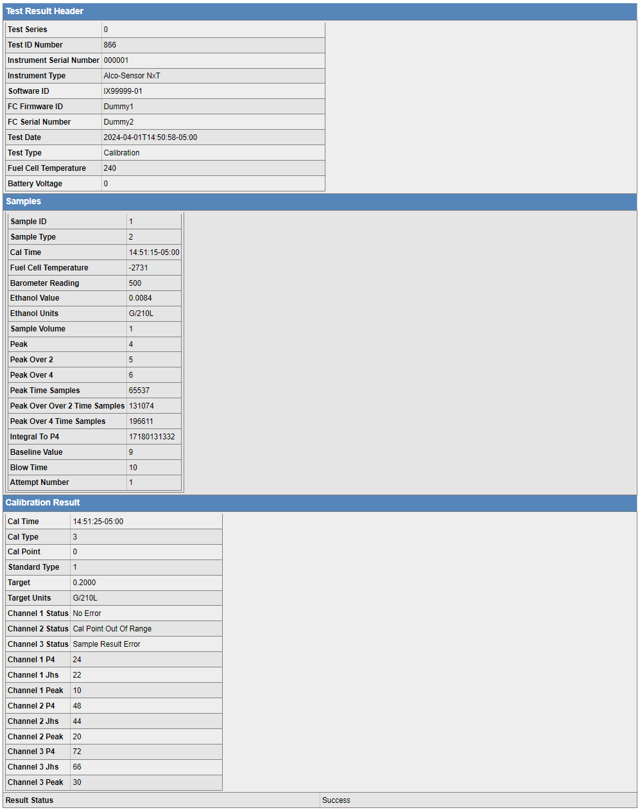

# JSON to Table (HTML)

### Install

`npm install jsontableify`

### Include

`const Jsontableify = require('jsontableify')`

### Features
* `toHTML(<json_object>)`: converts json to html code.
  * Date (Configurable formatting)
  * Links
  * JSON arrays
  * Labels get capitalized.
  * Hide few labels from table.
  * Replace text
  * Define section headers / main json keys
  * Replace field values 

* `toHTML(<json_object>,<json_schema>)`: converts json to html code using schema.
  * Use top level objects and object lists as source for header list
  * Use schema title fields as source for replace text
  * Use titles from oneOf sub schemas and $ref's to replace json field values

## Usage - no schema

```
const { html } = new Jsontableify({
  headerList: ['Phone', 'Attachments', 'PersonCompetency'], // optional - will be shown as header to table
  dateFormat: 'DD-MM-YYYY', // optional- date format to be converted to if date found
  replaceTextMap: { YearsOfExperience: 'Years Of Experience' }, // optional - key will be replaced by its value
  excludeKeys: ['Current CTC'], // optional - these fields will not be displayed
}).toHtml(<JSON object>)
```

### Example 1 - no schema, JSON only
```
{
  "CandidateName": "Yatish Balaji",
  "YearsOfExperience": 3,
  "Current CTC": 10,
  "Expected CTC": 25.0,
  "Address": {
    "CountryCode": "India",
    "Leaving from": "12-11-2017",
    "Leaved Till": "2019-11-06T07:00:30.103Z"
  },
  "Phone": [
    {
      "Number": "8828558654",
      "Label": "personal",
      "Preferred": "primary"
    },
    {
      "Number": "8828558123",
      "Label": "official"
    }
  ],
  "PersonCompetency": [
    {
      "CompetencyName": "Java",
      "Synonyms": [
        "sr j2ee resource",
        "java stack",
        "jpa",
        "advance java"
      ]
    },
    {
      "CompetencyName": "AWS",
      "Synonyms": [
        "aws",
        "amazon webservice",
        "amazon web service"
      ]
    }
  ],
  "Attachments": {
    "type": "link",
    "value": [
      {
        "name": "Quezx Posh",
        "link": ["https://www.quezx.com/safeplace/"]
      },
      {
        "name": "Quezx Posh Attacment",
        "link": ["https://www.quezx.com/safeplace/"]
      }
    ]
  }
}
```

## Usage - with Schema

```
const { html } = new Jsontableify().toHtml(<JSON object>,<JSON schmea>)
```

### Example 2 - with schema

JSON:
```
{"head":{"tsn":0,"tid":862,"sn":"000001","ityp":"NXT","sid":"IX99999-01","fcid":"Dummy1","fcsn":"Dummy2","td":"2024-04-01T14:48:05-05:00","ttyp":"AC","temp":240,"bat":0},"sample":[{"id":1,"saty":2,"time":"14:48:22-05:00","temp":-2731,"baro":500,"alc":"0.0084","alcunit":"g/210L","res":0,"vol":1,"peak":4,"peak2":5,"peak4":6,"peakT":65537,"peakT2":131074,"peakT4":196611,"p4Res":0,"jhs":0,"inte":17180131332,"base":9,"btim":10,"stdtype":0,"att":1}],"stat":0}
```

SCHEMA:
```
{"$schema":"https://json-schema.org/draft/2019-09/schema","$id":"https://example.com/jsontablify.json","definitions":{"statuscodes":{"oneOf":[{"const":-2,"title":"None"},{"const":-1,"title":"In progress"},{"const":0,"title":"Success"},{"const":1,"title":"Maximum volume exceeded"},{"const":2,"title":"Maximum flow exceeded"},{"const":3,"title":"Quick zero error"},{"const":4,"title":"Blow time exceeded"},{"const":5,"title":"Subject timeout"},{"const":6,"title":"Fuel cell timeout"},{"const":7,"title":"Fuel cell timeout"},{"const":8,"title":"Fuel cell baseline error"},{"const":9,"title":"Interferant detected"},{"const":10,"title":"Radio frequency interference detected"},{"const":11,"title":"Reverse flow detected"},{"const":12,"title":"Low flow"},{"const":13,"title":"Flow drop"},{"const":14,"title":"Suck back detected"},{"const":15,"title":"Late flow"},{"const":16,"title":"Peak stuck"},{"const":17,"title":"FC signal clipping"},{"const":18,"title":"FC over range"},{"const":19,"title":"Abort"},{"const":20,"title":"Baseline timeout"},{"const":21,"title":"Invalid results"},{"const":22,"title":"FC Power Error"},{"const":23,"title":"Motor Error"},{"const":24,"title":"Rise Time Timeout"},{"const":100,"title":"Refusal"},{"const":101,"title":"Communications timeout"},{"const":102,"title":"FC temperature out of range"},{"const":103,"title":"Sample position error"},{"const":104,"title":"Data storage error"},{"const":105,"title":"FC invalid status"},{"const":106,"title":"FC reset"},{"const":107,"title":"Calibration timeout"},{"const":108,"title":"Invalid calibration sample"},{"const":109,"title":"Set calibration parameters failed"},{"const":110,"title":"Get calibration result failed"},{"const":111,"title":"Get calibration result status failed"},{"const":201,"title":"Sample delivery timeout"},{"const":202,"title":"Sample analysis timeout"}]},"calstatusCodes":{"oneOf":[{"const":0,"title":"No Error"},{"const":1,"title":"Cal Point out of range"},{"const":2,"title":"Sample Result Error"},{"const":3,"title":"Low Peak Error"},{"const":4,"title":"Low Time Error"},{"const":5,"title":"Cal temperature Error"}]}},"type":"object","default":{},"title":"Test result root","required":["head","sample","stat"],"properties":{"head":{"type":"object","default":{},"title":"Test result header","required":["tsn","tid","sn","ityp","sid","fcid","fcsn","td","ttyp","temp","bat"],"properties":{"tsn":{"type":"integer","title":"Test series","minimum":0,"maximum":99},"tid":{"type":"integer","title":"Test ID number","minimum":0,"maximum":999999},"sn":{"type":"string","title":"Instrument serial number","pattern":"^\\d{6}$"},"ityp":{"title":"Instrument type","oneOf":[{"const":"NXT","title":"Alco-Sensor NxT"}]},"sid":{"type":"string","title":"Software ID","minLength":9,"maxLength":12},"fcid":{"type":"string","title":"FC Firmware ID","minLength":1,"maxLength":20},"fcsn":{"type":"string","title":"FC serial number","minLength":1,"maxLength":7},"td":{"type":"string","title":"Test date","format":"date-time"},"ttyp":{"title":"Test type","oneOf":[{"const":"BR","title":"Breath test"},{"const":"AC","title":"Accuracy check"},{"const":"CA","title":"Calibration"}]},"temp":{"type":"integer","title":"Temperature"},"bat":{"type":"number","title":"Battery voltage","minimum":0,"pattern":"^\\d{1,6}(\\.\\d{1,2})?$"}},"examples":[{"tsn":0,"tid":76,"sn":"010295","ityp":"NXT","sid":"IX99999-A","fcid":"dummy1","fcsn":"dummy2","td":"2023-04-29T14:32:51-06:00","ttyp":"BR","temp":"23","bat":"4.6"}]},"sample":{"type":"array","default":[],"title":"Samples","items":{"type":"object","title":"Sample","properties":{"id":{"type":"integer","title":"Sample ID","minimum":0,"maximum":999},"saty":{"title":"Sample type","oneOf":[{"const":0,"title":"Manifold blank"},{"const":1,"title":"External standard"},{"const":2,"title":"Subject sample"}]},"time":{"title":"Sample time","type":"string","format":"time"},"temp":{"type":"number","title":"Fuel cell temperature","minimum":-400,"maximum":1250},"baro":{"type":"integer","title":"Barometer reading","minimum":300,"maximum":1200},"alc":{"type":"string","title":"Ethanol value","minLength":1,"maxLength":16},"alcunit":{"type":"string","title":"Ethanol units","minLength":1,"maxLength":16},"res":{"title":"Sample status","allOf":[{"$ref":"#/definitions/statuscodes"}]},"vol":{"type":"integer","title":"Sample volume","minimum":0,"maximum":6000},"peak":{"type":"integer","title":"Peak","minimum":0,"maximum":65535},"peak2":{"type":"integer","title":"Peak over 2","minimum":0,"maximum":65535},"peak4":{"type":"integer","title":"Peak over 4","minimum":0,"maximum":65535},"peakT":{"type":"integer","title":"Peak time samples","minimum":0,"maximum":4000000000},"peakT2":{"type":"integer","title":"Peak over over 2 time samples","minimum":0,"maximum":4000000000},"peakT4":{"type":"integer","title":"Peak over 4 time samples","minimum":0,"maximum":4000000000},"p4Res":{"type":"integer","title":"Peak over 4 result","minimum":0,"maximum":150000},"jhs":{"type":"integer","title":"JHS result","minimum":0,"maximum":150000},"inte":{"type":"integer","title":"Integral to P4","minimum":0,"maximum":30000000000},"base":{"type":"integer","title":"Baseline value","minimum":0,"maximum":65535},"btim":{"type":"integer","title":"Blow time","minimum":0,"maximum":65535},"att":{"type":"integer","title":"Attempt number","minimum":0,"maximum":9},"stdtype":{"type":"integer","title":"Standard Type","minimum":0,"maximum":3}},"examples":[{"id":1,"saty":0,"time":"15:16:33-06:00","temp":"3","baro":2,"alc":0,"res":0,"vol":1,"peak":100,"peak2":50,"peak4":25,"peakT":65537,"peakT2":131074,"peakT4":196611,"p4Res":7,"jhs":8,"inte":86973956,"base":9,"btime":10}]}},"cal":{"type":"object","default":{},"title":"Calibration Result","required":["time","typ","poi"],"properties":{"time":{"title":"Cal Time","type":"string","format":"time"},"typ":{"type":"integer","title":"Cal Type","minimum":0,"maximum":4},"poi":{"type":"integer","title":"Cal Point","minimum":0,"maximum":4},"stty":{"type":"integer","title":"Standard Type","minimum":0,"maximum":3},"tar":{"type":"string","title":"Target","minLength":1,"maxLength":16},"tarunit":{"type":"string","title":"Target Units","minLength":1,"maxLength":16},"1stat":{"title":"Channel 1 Status","allOf":[{"$ref":"#/definitions/calstatusCodes"}]},"2stat":{"title":"Channel 2 Status","allOf":[{"$ref":"#/definitions/calstatusCodes"}]},"3stat":{"title":"Channel 3 Status","allOf":[{"$ref":"#/definitions/calstatusCodes"}]},"1p4":{"type":"integer","title":"Channel 1 P4","minimum":0,"maximum":150000},"1jhs":{"type":"integer","title":"Channel 1 Jhs","minimum":0,"maximum":150000},"1pk":{"type":"integer","title":"Channel 1 Peak","minimum":0,"maximum":150000},"2p4":{"type":"integer","title":"Channel 2 P4","minimum":0,"maximum":150000},"2jhs":{"type":"integer","title":"Channel 2 Jhs","minimum":0,"maximum":150000},"2pk":{"type":"integer","title":"Channel 2 Peak","minimum":0,"maximum":150000},"3p4":{"type":"integer","title":"Channel 3 P4","minimum":0,"maximum":150000},"3jhs":{"type":"integer","title":"Channel 3 Jhs","minimum":0,"maximum":150000},"3pk":{"type":"integer","title":"Channel 3 Peak","minimum":0,"maximum":150000},"1qz":{"type":"integer","title":"Channel 1 Quick Zero","minimum":0,"maximum":150000},"2qz":{"type":"integer","title":"Channel 2 Quick Zero","minimum":0,"maximum":150000},"3qz":{"type":"integer","title":"Channel 3 Quick Zero","minimum":0,"maximum":150000},"1rat":{"type":"number","title":"Channel 1 Interference Ratio"},"2rat":{"type":"number","title":"Channel 2 Interference Ratio"},"3rat":{"type":"number","title":"Channel 3 Interference Ratio"}}},"stat":{"title":"Result status","allOf":[{"$ref":"#/definitions/statuscodes"}]}}}
```


### Output

HTML table 

HTML table 

### CSS for HTML code

https://github.com/yatishbalaji/jsontableify/blob/master/examples/toHtml.css
